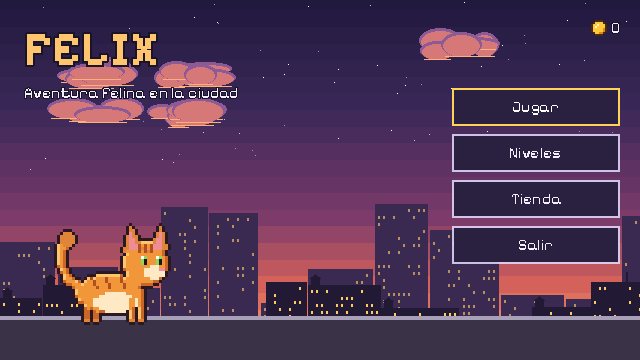
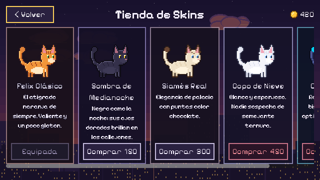
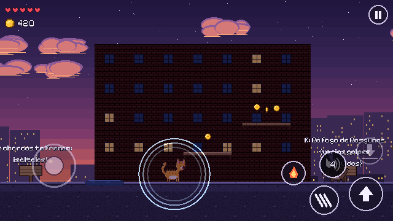
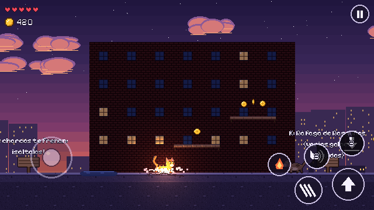
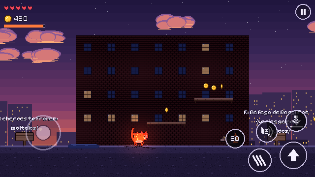
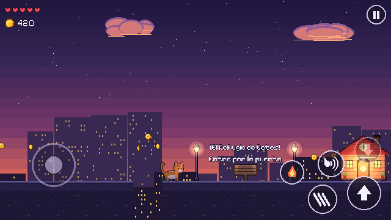

# Felix: aventura felina en la ciudad

Juego de plataformas y acción 2D en Pixel Art para **móvil (Android / iOS)**, hecho con **Godot 4.7** (renderer *Mobile*).
Felix, un gato con cuatro habilidades, cruza 10 niveles de la ciudad hasta el **Refugio de Gatos**.

  -orange)

> El arte incluido es **provisional**. Está generado por código con el **layout definitivo** de cada hoja de sprites: al sustituirlo por el arte final (IA o artista), el juego no necesita cambios. Ver [docs/05](docs/05_Sprites_y_Animaciones.md) y [docs/06](docs/06_Prompts_IA.md).

| | |
|---|---|
|  |  |
|  |  |
|  |  |

*Capturas reales del proyecto (arte provisional) en Godot 4.7.2: menú, tienda, Aullido Expansivo, Golpe Sísmico, Furia Felina y el Refugio de Gatos.*

## Cómo abrirlo y probarlo

1. Instala **Godot 4.7.2** (versión estándar, no .NET).
2. En el Project Manager: **Importar** → selecciona `project.godot` de esta carpeta.
3. Pulsa **F5** (o ▶). Arranca en el menú principal.
4. Para probar un nivel directamente: abre `scenes/levels/Level_1.tscn` y pulsa **F6**.

En escritorio se ven los controles táctiles y se pueden pulsar con el ratón (`Emulate Touch From Mouse` está activo). El teclado también funciona:

| Acción | Teclado | Mando | Móvil |
|---|---|---|---|
| Moverse | A / D o ← → | Stick izq. / cruceta | Joystick flotante (mitad izquierda) |
| Saltar (mantener = más alto) | Espacio, W, ↑ | A | Botón ⬆ |
| 1 · Aullido Expansivo | J, 1, Z | Y | Botón de ondas |
| 2 · Ráfaga de Rasguños | K, 2, X | X | Botón de garras |
| 3 · Furia Felina | L, 3, C | RB | Botón de llama |
| 4 · Golpe Sísmico (en el aire) | I, 4, V | B | Botón flecha abajo |
| Pausa | Esc, P | Start | Botón ⏸ / botón "atrás" de Android |

## Qué incluye

- **Felix** (`scenes/player/Player.tscn` + `scripts/player/Player.gd`): máquina de estados con 12 estados, física de salto configurada por altura y tiempos, coyote time, jump buffer, salto variable y las 4 habilidades con tiempo de recarga.
- **Enemigos**: perro callejero (embestida con `RayCast2D`), cuervo (vuelo senoidal y picados) y aspiradora robot (invencible, rebota en paredes).
- **Obstáculos**: charcos que frenan, cajas que caen (colgantes y desde grúas) y ovillos gigantes rodantes.
- **10 niveles** jugables (greybox) con dificultad progresiva, fondos `ParallaxBackground` de 4 capas, iluminación dinámica con normal maps, sombras y brillos.
- **Economía y tienda**: `Global.gd` (Autoload) con monedas persistentes, 5 skins comprables y guardado atómico.
- **UI móvil**: joystick nativo de Godot 4.7, botones de habilidad con recarga radial, pausa, respeto de muescas (safe area), vibración y botón "atrás" de Android.

## Documentación

| Documento | Contenido |
|---|---|
| [01 · Arquitectura y escenas](docs/01_Arquitectura_y_Escenas.md) | Carpetas, Autoloads, capas de colisión, flujo de señales y **árboles de nodos de `Player.tscn` y `Level_1.tscn`** |
| [02 · Jugador y habilidades](docs/02_Jugador_y_Habilidades.md) | Máquina de estados, física del salto, las 4 habilidades y el sistema de daño |
| [03 · Enemigos, obstáculos y niveles](docs/03_Enemigos_Obstaculos_y_Niveles.md) | IA de cada enemigo, obstáculos y progresión de los 10 niveles |
| [04 · Iluminación y normal maps](docs/04_Iluminacion_y_Normal_Maps.md) | Guía de `CanvasTexture`, `PointLight2D`, `CanvasModulate`, sombras y brillos |
| [05 · Sprites y animaciones](docs/05_Sprites_y_Animaciones.md) | Estructura de la hoja de sprites, frames y FPS de cada estado |
| [06 · Prompts de IA](docs/06_Prompts_IA.md) | Prompts para generar el arte de Felix, enemigos, fondos y UI |
| [07 · Economía y tienda](docs/07_Economia_y_Tienda.md) | `Global.gd`, guardado, compra y aplicación de skins |
| [08 · Móvil y exportación](docs/08_Movil_y_Exportacion.md) | Controles táctiles, rendimiento y exportar a Android / iOS |

## Estructura del proyecto

```
assets/        Arte (PNG), fuente pixel y sus normal maps
docs/          Documentación (este diseño)
resources/     Recursos .tres: skins, tileset, tema de UI, luces, materiales
scenes/        Escenas: player, enemies, obstacles, world, fx, ui, levels
scripts/       GDScript: autoload, components, player, enemies, obstacles, world, fx, ui
tools/         Herramientas: generador de arte provisional, normal maps y niveles
```

## Herramientas

```bash
# Normal map para una hoja de sprites nueva (pip install pillow numpy)
python tools/art/generate_normal_map.py assets/sprites/player/felix_classic.png -o felix_normal.png --cell 48x48

# Regenerar los mapas ASCII y las escenas de los niveles (¡sobrescribe los .tscn!)
python tools/levels/generate_level_maps.py
godot --headless --path . --script res://tools/LevelBuilder.gd
```

## Créditos

- Código, diseño y arte provisional: proyecto Felix.
- Fuente **Pixelify Sans** © 2021 The Pixelify Sans Project Authors, licencia SIL Open Font License 1.1 (`assets/fonts/OFL.txt`).
