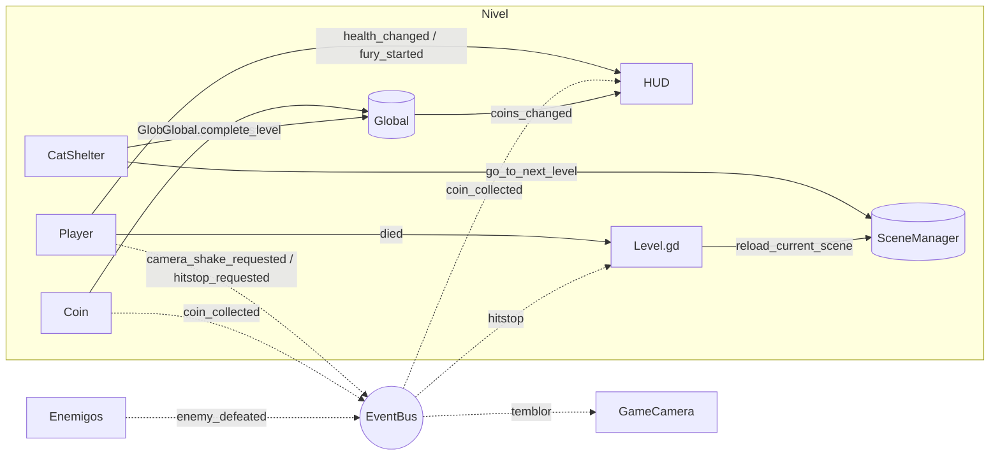

# 01 · Arquitectura y escenas

Este documento describe **cómo está organizado el proyecto**: carpetas, singletons (Autoloads), capas de colisión, el flujo de señales y los árboles de nodos de las escenas principales, incluidos **`Player.tscn`** y **`Level_1.tscn`**.

## 1. Principios de diseño

| Principio | Cómo se aplica |
|---|---|
| **Composición antes que herencia** | El daño se resuelve con componentes reutilizables (`Hitbox`, `Hurtbox`, `HealthComponent`) que sirven igual para Felix, enemigos y obstáculos. |
| **Máquinas de estados explícitas** | Felix (12 estados) y cada enemigo tienen una FSM con entrada / lógica / salida. Las transiciones solo pasan por `_change_state()`. |
| **Datos en recursos, no en código** | Las skins son recursos `SkinData`; los valores de juego son `@export` editables en el Inspector. |
| **Desacoplar con señales** | Relaciones con dueño claro (HUD ↔ Felix) usan señales del propio nodo; los eventos transversales (temblor de cámara, hitstop, monedas) usan el `EventBus`. |
| **Nunca `PackedScene` del siguiente nivel exportada** | Se cargan rutas con `ResourceLoader.load_threaded_request()`; exportar el `PackedScene` del nivel siguiente cargaría en memoria toda la cadena de niveles. |
| **Móvil primero** | Controles táctiles, 60 FPS, partículas por CPU, generadores que solo trabajan en pantalla y guardado atómico. |

## 2. Carpetas

```
res://
├── assets/                 Arte fuente (PNG) + normal maps (*_n.png / *_normal.png)
│   ├── backgrounds/        Capas del ParallaxBackground (cielo, nubes, ciudad lejana y cercana)
│   ├── fonts/              Pixelify Sans (OFL) + licencia
│   ├── sprites/            player/, enemies/, obstacles/, world/, fx/
│   ├── tilesets/           city_tiles.png + city_tiles_n.png
│   └── ui/                 Botones táctiles, corazones, moneda, candado, joystick
├── docs/                   Esta documentación
├── resources/
│   ├── environments/       level_environment.tres (glow)
│   ├── lights/             light_soft.tres (GradientTexture2D radial)
│   ├── materials/          unshaded.tres, unshaded_add.tres
│   ├── skins/              skin_*.tres + SkinCatalog.tres
│   ├── themes/             ui_theme.tres (fuente pixel, botones, paneles)
│   └── tilesets/           city_tileset.tres
├── scenes/
│   ├── player/             Player.tscn
│   ├── enemies/            StrayDog.tscn, Crow.tscn, RobotVacuum.tscn
│   ├── obstacles/          Puddle, FallingCrate, CrateSpawner, YarnBall, YarnBallSpawner
│   ├── world/              Coin, CatShelter, StreetLamp, TutorialSign, KillZone, ParallaxCity
│   ├── fx/                 SlashEffect, SeismicCrack y ráfagas de partículas
│   ├── ui/                 HUD, AbilityButton, PauseMenu, MainMenu, Shop, SkinCard
│   └── levels/             Level_1.tscn … Level_10.tscn
├── scripts/                Misma división que scenes/ + autoload/, components/, resources/
└── tools/                  Generadores (arte provisional, normal maps, niveles). Excluir al exportar.
```

> Los nombres `Player.gd`, `Global.gd`, `Player.tscn` y `Level_1.tscn` siguen el GDD. En Android e iOS las rutas distinguen mayúsculas: escribe siempre la ruta exacta (o usa UIDs).

## 3. Autoloads (singletons)

Orden de carga (importa: `Global` usa `EventBus`, `SceneManager` usa `Global`):

| Nombre | Script | Responsabilidad |
|---|---|---|
| `EventBus` | `scripts/autoload/EventBus.gd` | Solo señales globales: `coin_collected`, `enemy_defeated`, `player_died`, `level_completed`, `camera_shake_requested`, `hitstop_requested`. |
| `Global` | `scripts/autoload/Global.gd` | Monedas persistentes, monedas del intento, tienda y skins, progreso (niveles desbloqueados), vibración, guardado atómico en `user://savegame.cfg`. Ver [07](07_Economia_y_Tienda.md). |
| `SceneManager` | `scripts/autoload/SceneManager.gd` | Cambios de escena con fundido, carga en hilo, reinicio de nivel, ir al siguiente nivel, menú y tienda. |

## 4. Capas de colisión (Project Settings → Layer Names → 2D Physics)

| # | Nombre | Quién está en la capa | Quién la detecta (máscara) |
|---|---|---|---|
| 1 | `world` | TileMapLayer `Ground`, cajas aterrizadas | Felix, enemigos, cajas, ovillos, RayCasts |
| 2 | `player` | Cuerpo de Felix | Monedas, charcos, Refugio, detector de cajas, KillZone, `VisionRay` del perro |
| 3 | `enemies` | Cuerpos de enemigos y ovillos | KillZone |
| 4 | `player_hitbox` | Aullido, Rasguños, Golpe Sísmico | — |
| 5 | `enemy_hitbox` | Contacto de enemigos, cajas que caen, ovillos | — |
| 6 | `player_hurtbox` | Hurtbox de Felix | Hitboxes de enemigos/obstáculos (máscara 6) |
| 7 | `enemy_hurtbox` | Hurtbox de enemigos | Hitboxes de Felix (máscara 7) |
| 8 | `pickups` | Monedas | — |
| 9 | `triggers` | Charcos, Refugio, KillZone, detector de cajas | — |

Reglas: Felix y los enemigos **no chocan entre sí** (el contacto se resuelve con hitboxes, así nadie se queda atascado), y los enemigos no chocan entre ellos (no se amontonan).

## 5. Flujo de señales



## 6. Componentes de combate

| Componente | Tipo | Qué hace |
|---|---|---|
| `HitData` | `RefCounted` | Paquete del golpe: `damage`, `knockback`, `source`, `hitbox`. |
| `Hitbox` | `Area2D` | Inflige daño a los `Hurtbox` que solapa. Modos: golpe único por activación (`rehit_interval = 0`) o daño continuo (`rehit_interval > 0`). Retroceso `FROM_SOURCE`, `RADIAL` o `FACING`. Filtro opcional por grupo (`required_target_group`). |
| `Hurtbox` | `Area2D` | Recibe golpes: resta vida al `HealthComponent`, gestiona i-frames (con parpadeo) e invulnerabilidad forzada; emite `hurt` o `blocked`. |
| `HealthComponent` | `Node` | Vida con señales `health_changed`, `damaged`, `healed`, `died`. |

El `Hitbox` consulta los solapamientos en cada frame de física (no solo en `area_entered`): así un objetivo que ya estaba dentro al activarse también recibe el golpe, y la Ráfaga de Rasguños puede "reactivar" el hitbox en cada tick.

## 7. Árbol de nodos de `Player.tscn`

`%` = nodo con **nombre único** (se accede desde el script con `%Nombre`, aunque cambie de sitio en el árbol).

```
Player (CharacterBody2D) · Player.gd · capa 2 "player", máscara 1 "world", grupo "player"
├── CollisionShape2D ··········· RectangleShape2D 14×18 en (0,-9). El origen del cuerpo son los pies.
├── %Visuals (Node2D) ·········· Recibe el tinte (modulate) pulsante de la Furia Felina.
│   ├── %FuryAura (PointLight2D)  Apagada. Luz naranja con normal maps durante la Furia (height 16).
│   └── %Sprite (Sprite2D) ····· CanvasTexture = felix_classic.png + felix_normal.png
│                                 hframes 10 · vframes 13 · posición (0,-22) · flip_h para girar
├── %HowlWave (Node2D) ········· HowlWave.gd: anillos del Aullido dibujados con _draw()
│                                 (material unshaded + aditivo: brillan en la oscuridad)
├── %AnimationPlayer ··········· 14 animaciones sobre "Visuals/Sprite:frame_coords" (+ RESET)
├── %HealthComponent (Node) ···· max_health = 5 (corazones)
├── %Hurtbox (Area2D) ·········· Hurtbox.gd · capa 6 · i-frames 1 s con parpadeo
│   └── CollisionShape2D ······· 12×16
├── %HowlHitbox (Area2D) ······· Hitbox.gd · capa 4 → máscara 7 · RADIAL · inactivo · en (0,-12)
│   └── %HowlShape ············· CircleShape2D r = 10 → un Tween lo agranda hasta 88 px en 0,25 s
├── %ScratchHitbox (Area2D) ···· Hitbox.gd · FACING · inactivo · en (±18,-11) según la orientación
│   └── CollisionShape2D ······· 26×20
├── %SlamHitbox (Area2D) ······· Hitbox.gd · FROM_SOURCE · solo grupo "ground_enemy" · en (0,-8)
│   └── CollisionShape2D ······· 128×20 (rectángulo amplio a ras de suelo)
├── %SlashSpawn (Marker2D) ····· (±22,-13): donde aparece el efecto de zarpazo
├── %GroundProbe (RayCast2D) ··· 20 px hacia abajo: altura mínima para el Golpe Sísmico
├── %FuryTimer (Timer) ········· one_shot: duración del buff (8 s)
└── Particles (Node2D)
    ├── %DustParticles ········· CPUParticles2D: polvo al saltar, aterrizar e impactar
    ├── %SlamDebris ············ CPUParticles2D: escombros del Golpe Sísmico
    └── %FuryEmbers ············ CPUParticles2D: brasas durante la Furia (aditivas)
```

Escenas de efectos que Felix instancia (exportadas en el Inspector del `Player`):

- `slash_scene` → `scenes/fx/SlashEffect.tscn` (zarpazo de 4 frames que se libera solo).
- `crack_scene` → `scenes/fx/SeismicCrack.tscn` (grieta en el suelo + destello de luz `PointLight2D`).

Los efectos se añaden al nodo del grupo `effects_layer` del nivel (`Effects`), para que se queden en el mundo aunque Felix se mueva.

## 8. Árbol de nodos de `Level_1.tscn`

```
Level_1 (Node2D) · Level.gd · level_index = 0 · level_name = "Nivel 1 / Callejón al Anochecer"
├── WorldEnvironment ··········· level_environment.tres: fondo Canvas + glow (brillos)
├── CanvasModulate ············· Luz ambiente del MUNDO: #8f86c4 (anochecer). Las luces suman encima.
├── ParallaxCity (instancia) ··· ParallaxBackground = CanvasLayer propio (layer -100)
│   ├── Sky (ParallaxLayer) ······· motion_scale (0,0): cielo fijo → Gradient + Stars (luna)
│   ├── Clouds (ParallaxLayer) ···· AutoScrollLayer.gd · motion_scale (0.08, 0.02) · mirroring 960 · deriva sola
│   ├── FarCity (ParallaxLayer) ··· motion_scale (0.2, 0.05) · mirroring 960 · edificios lejanos
│   ├── NearCity (ParallaxLayer) ·· motion_scale (0.45, 0.1) · mirroring 960 · fondo inmediato + relleno
│   └── BackgroundTint (CanvasModulate)  Tinte PROPIO del fondo (el del mundo no le afecta)
├── World (Node2D)
│   ├── BackWall (TileMapLayer) ··· z -1 · fachadas y ventanas decorativas, sin colisión
│   ├── %Ground (TileMapLayer) ···· Colisión (capa 1), plataformas de un sentido y oclusores de luz
│   └── Foreground (TileMapLayer) · z 2 · hierba por delante de Felix
├── Decor (Node2D)
│   ├── StreetLamp ×5 ············· Sprite con normal map + PointLight2D con sombras y parpadeo
│   ├── TutorialSign ×8 ··········· Texto de teclado o táctil según el dispositivo
│   └── CatShelter ················ META: Area2D + casa + luz cálida con sombras + corazones
├── Obstacles (Node2D) ············ Puddle
├── Pickups (Node2D) ·············· Coin ×28
├── Enemies (Node2D) ·············· StrayDog ×6
├── %Player (instancia Player.tscn)  Después de enemigos y obstáculos: se dibuja por delante
├── Effects (Node2D) ·············· Grupo "effects_layer": grietas, zarpazos, polvo
├── KillZone (instancia) ·········· WorldBoundaryShape2D 48 px por debajo del mapa
├── %GameCamera (Camera2D) ········ GameCamera.gd: suavizado, look-ahead, temblor por trauma, límites
├── %HUD (instancia HUD.tscn) ····· CanvasLayer 10 (no le afecta el CanvasModulate)
└── PauseMenu (instancia) ········· CanvasLayer 20 · process_mode ALWAYS
```

Por qué este orden:

- **Orden de dibujado**: en 2D el árbol decide qué se dibuja encima. Fondo → paredes → suelo → decoración → obstáculos → monedas → enemigos → Felix → efectos. `z_index` solo se usa en excepciones (pared de fondo -1, charcos 1 para "mojar" las patas, hierba 2).
- **Tres "lienzos" (canvas)**: el mundo, el `ParallaxBackground` y cada `CanvasLayer` de UI tienen su propio lienzo. Por eso hay **dos `CanvasModulate`**: uno para el mundo y otro dentro del fondo. Las luces del mundo tampoco iluminan el fondo, y la UI nunca se oscurece. Detalle completo en [04](04_Iluminacion_y_Normal_Maps.md).
- **Level.gd** conecta el HUD con Felix, calcula los límites de la cámara a partir de los tiles usados, reinicia el nivel al morir y aplica el *hitstop*.

### Sistema de victoria: el Refugio de Gatos

```
CatShelter (Area2D) · CatShelter.gd · capa 9, máscara 2 (solo Felix)
├── CollisionShape2D ··· 36×40 frente a la puerta
├── House (Sprite2D) ··· cat_shelter.png + normal map
├── WindowGlow ········· halo aditivo sobre la ventana
├── %Door (Marker2D) ··· adonde camina Felix al entrar
├── %WindowLight ······· PointLight2D cálida con sombras + FlickerLight.gd (fuego de chimenea)
└── %Hearts ············ CPUParticles2D de corazones
```

Al atravesarlo: Felix pasa al estado `VICTORY` (camina hasta la puerta y se sienta feliz), sube la luz, salen corazones, `Global.complete_level()` deposita las monedas y desbloquea el nivel siguiente, y tras 1,6 s `SceneManager.go_to_next_level()` carga la siguiente escena en segundo plano con fundido. `next_scene_override` permite saltar a otra escena concreta.

## 9. Otras escenas

| Escena | Raíz | Notas |
|---|---|---|
| `StrayDog.tscn` | CharacterBody2D | `VisionRay`, `WallRay` y `LedgeRay` (RayCast2D), `ContactHitbox`, `Hurtbox`, `HealthComponent` (6) |
| `Crow.tscn` | CharacterBody2D (modo flotante) | Sin gravedad, `HealthComponent` (2), grupo `air_enemy` |
| `RobotVacuum.tscn` | CharacterBody2D | `Hurtbox` invencible, `LedgeRay`, luz LED cian |
| `FallingCrate.tscn` | CharacterBody2D | `Rope` (Line2D), `Detector` (columna Area2D), `Hitbox` activo solo al caer |
| `CrateSpawner.tscn` / `YarnBallSpawner.tscn` | Marker2D | `ObstacleSpawner.gd` + `VisibleOnScreenNotifier2D` |
| `Puddle.tscn` | Area2D (`@tool`) | `NinePatchRect` con CanvasTexture especular; `width` ajustable en el editor |
| `HUD.tscn` | CanvasLayer | `SafeAreaMargin` → corazones, monedas, barra de Furia, banner, pausa, `VirtualJoystick` y 5 botones |
| `AbilityButton.tscn` | TouchScreenButton | `TextureProgressBar` radial + `Label` de segundos |
| `MainMenu.tscn` / `Shop.tscn` | Control | Reutilizan `ParallaxCity` como fondo animado |
