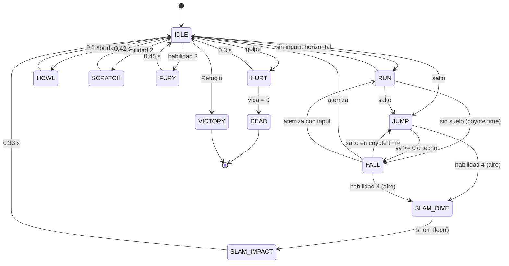

# 02 · Jugador y habilidades (`Player.gd`)

`scripts/player/Player.gd` contiene la **máquina de estados**, el **control de físicas** y la **activación de las 4 habilidades**. Todos los valores numéricos son `@export` agrupados en el Inspector (Movimiento, Salto, Combate, una sección por habilidad y Efectos): se ajustan sin tocar código, incluso en caliente con el depurador remoto.

## 1. Máquina de estados



> "Volver a neutral" (`_return_to_neutral()`) elige IDLE, RUN o FALL según haya suelo e input. Cualquier estado salvo DEAD/VICTORY puede pasar a HURT (salvo si es invulnerable: picado sísmico y lanzamiento de la Furia).

### Estructura de cada estado

Cada estado tiene tres piezas y todas las transiciones pasan por `_change_state()`:

| Pieza | Dónde | Para qué |
|---|---|---|
| Entrada | `_enter_state()` | Animación, velocidades iniciales, activar invulnerabilidad, lanzar efectos |
| Lógica por frame | `_physics_<estado>()` | Gravedad, movimiento, temporizadores, decidir la transición |
| Salida | `_exit_state()` | Apagar hitboxes y quitar invulnerabilidades **aunque el estado se interrumpa** |

Ejemplo: si un perro golpea a Felix a mitad de la Ráfaga de Rasguños, `_exit_state(SCRATCH)` apaga el `ScratchHitbox`; sin esa pieza, el hitbox seguiría dañando.

### Tabla de estados

| Estado | Animación | Física | Sale a |
|---|---|---|---|
| `IDLE` | `idle` (o `land` → `idle`) | Gravedad, fricción | RUN, JUMP, FALL, habilidad |
| `RUN` | `run` | Aceleración / giro rápido | IDLE, JUMP, FALL, habilidad |
| `JUMP` | `jump` | Gravedad de subida, salto variable, apex hang | FALL, habilidad |
| `FALL` | `fall` | Gravedad de caída, coyote jump | IDLE/RUN, JUMP (coyote), habilidad |
| `HOWL` | `howl` | Frena; en el aire gravedad ×0,2 | neutral a los 0,5 s |
| `SCRATCH` | `scratch` | Avance 70 px/s; en el aire gravedad ×0,35 | neutral a los 0,42 s |
| `FURY` | `fury` | Frena; invulnerable | neutral a los 0,45 s |
| `SLAM_DIVE` | `slam_start` → `slam_dive` | 0,1 s quieto; luego caída con gravedad ×4,5 (hasta 900 px/s); invulnerable | SLAM_IMPACT al tocar suelo |
| `SLAM_IMPACT` | `slam_impact` | Quieto; hitbox 0,12 s | neutral a los 0,33 s |
| `HURT` | `hurt` | Retroceso del golpe, sin control | neutral a los 0,3 s |
| `DEAD` | `death` | Saltito y caída; sin control | el nivel se reinicia |
| `VICTORY` | `run` → `victory` | Camina sola hasta la puerta del Refugio | carga del siguiente nivel |

## 2. Física de plataformas

### Salto definido por el diseñador

En lugar de ajustar "gravedad" y "fuerza de salto" a ojo, se definen **altura** y **tiempos** y el script deriva el resto (`_update_jump_physics()`):

```
v₀         = −2h / t_subida        = −2·58 / 0,36   ≈ −322 px/s
g_subida   =  2h / t_subida²       =  2·58 / 0,36²  ≈  895 px/s²
g_caída    =  2h / t_caída²        =  2·58 / 0,30²  ≈ 1289 px/s²
```

Con `run_speed = 150 px/s`, un salto completo recorre ≈ 150 × (0,36 + 0,30) ≈ **99 px ≈ 6 tiles**. Los niveles respetan esos límites: fosos de hasta 4 tiles y escalones de hasta 3 tiles (48 px < 58 px).

### Técnicas de "game feel"

| Técnica | Valor | Efecto |
|---|---|---|
| Coyote time | 0,10 s | Se puede saltar un instante después de salir del borde |
| Jump buffer | 0,12 s | Un salto pulsado justo antes de aterrizar se ejecuta al tocar el suelo |
| Salto variable | ×0,45 | Soltar el botón mientras se sube recorta el salto (también en saltos del búfer ya soltados) |
| Apex hang | \|vy\| < 45 → g ×0,55 | Más control en el punto alto si se mantiene el botón |
| Caída más pesada | g_caída > g_subida | Saltos rápidos y "con peso" |
| Giro ágil | 2600 px/s² | Cambiar de dirección en el suelo es inmediato |
| Control aéreo | 950 / 420 px/s² | Aceleración y fricción menores en el aire |
| Velocidad máx. de caída | 420 px/s | Caídas legibles en pantallas pequeñas |

## 3. Las cuatro habilidades

Todas comparten el mismo flujo de activación:

1. `_read_input()` guarda la habilidad pulsada en un **búfer de 0,15 s** (se puede encadenar una habilidad pulsándola al final de otra).
2. En un estado libre (IDLE, RUN, JUMP, FALL), `_try_start_buffered_ability()` comprueba `can_use_ability()`: recarga terminada + condición propia (Golpe Sísmico solo en el aire y a más de 20 px del suelo; Furia solo si no está activa).
3. Arranca el **tiempo de recarga** (desde la activación), emite `ability_activated` y cambia al estado de la habilidad.

**Daño final** = `base_damage × potencia de la habilidad × multiplicador` (Furia = ×2), redondeado y como mínimo 1.

| | 1 · Aullido Expansivo | 2 · Ráfaga de Rasguños | 3 · Furia Felina | 4 · Golpe Sísmico |
|---|---|---|---|---|
| Recarga | 4 s | 0,8 s | 20 s | 3 s |
| Duración | 0,5 s (onda a los 0,18 s) | 0,42 s | 0,45 s de lanzamiento + **8 s** de buff (Timer) | 0,1 s de pausa + picado + 0,33 s |
| Hitbox | Círculo que crece de 10 a 88 px en 0,25 s | Rectángulo frontal 26×20 | — | Rectángulo 128×20 a ras de suelo |
| Daño normal / con Furia | 2 / 4 | 5 ticks × 1 / × 2 | ×2 al daño base | 4 / 8 |
| Retroceso | Radial 330 px/s + elevación | 40 por tick; remate 240 + 150 hacia arriba | — | 200 + 280 hacia arriba |
| Golpes por objetivo | 1 por uso | 1 por tick (5 ticks) | — | 1; **solo `ground_enemy`** |
| Extras | Hover en el aire, temblor 0,25 | Zarpazo visual alterno, avance | Tinte pulsante, aura de luz, brasas, invulnerable al lanzar | Grieta en el suelo, destello de luz, escombros, temblor 0,65, hitstop 0,06 s, vibración |

### 1 · Aullido Expansivo

`_release_howl()` configura el `HowlHitbox` y anima el **radio del `CircleShape2D`** con un `Tween` (curva cúbica: crece muy rápido al principio). El hitbox está en modo golpe único, así que cada enemigo recibe un impacto por aullido aunque siga dentro del círculo. `HowlWave` dibuja los anillos al mismo ritmo. La forma se duplica en `_ready()` para que cada instancia tenga su propio radio.

### 2 · Ráfaga de Rasguños

El `ScratchHitbox` se **reactiva en cada tick** (`scratch_first_hit_time + n × scratch_hit_interval` = 0,04; 0,12; 0,20; 0,28; 0,36 s). Reactivar borra la memoria de impactos, así que cada tick golpea una vez a cada enemigo del área: son los "múltiples instantes de daño continuo". El último tick es un remate con mucho más retroceso. Los enemigos aturdidos no hacen daño por contacto, así que acertar el combo cuerpo a cuerpo no castiga a Felix.

### 3 · Furia Felina (buff)

`_activate_fury()` arranca `FuryTimer` (8 s), enciende `FuryAura` y `FuryEmbers` y crea un `Tween` en bucle sobre `Visuals.modulate` (valores > 1 para que "brille"). Mientras el Timer corre, `get_damage_multiplier()` devuelve 2. Al acabar (`timeout` → `_end_fury()`) todo vuelve a la normalidad. La Furia es **paralela** a la máquina de estados: Felix puede correr, saltar y usar otras habilidades mientras dura.

### 4 · Golpe Sísmico

- `SLAM_DIVE`: 0,1 s congelado en el aire (anticipación), luego `velocity.y = 380` y gravedad de caída × 4,5 hasta 900 px/s. Felix es invulnerable durante el picado.
- Al detectar `is_on_floor()` pasa a `SLAM_IMPACT`: activa el `SlamHitbox` 0,12 s, instancia `SeismicCrack` (grieta + luz), reinicia las partículas, pide temblor, *hitstop* y vibración.
- El filtro `required_target_group = "ground_enemy"` hace que los cuervos no reciban daño.

## 4. Daño recibido, muerte y victoria

- `Hurtbox.hurt` → `_on_hurt()`: aplica el retroceso del `HitData`, pasa a `HURT`, temblor, *hitstop* de 0,05 s y vibración. El Hurtbox da **1 s de i-frames** con parpadeo.
- `HealthComponent.died` → `DEAD`: termina la Furia, apaga hitboxes, emite `died` y `EventBus.player_died`. `Level.gd` espera 1 s, descarta las monedas del intento y reinicia el nivel.
- `KillZone` (bajo el mapa) llama a `kill()` de forma diferida.
- `enter_shelter()` → `VICTORY`: sin control, camina hasta la puerta y reproduce `victory`.

## 5. API pública (para UI y otros sistemas)

| Método / señal | Uso |
|---|---|
| `get_cooldown_ratio(ability)` / `get_cooldown_remaining(ability)` | Barrido radial y segundos de los botones |
| `is_ability_ready(ability)` | Atenuar botones no disponibles (Golpe Sísmico en el suelo) |
| `is_fury_active()` / `get_fury_time_left()` | Barra de Furia del HUD |
| `add_speed_modifier(fuente, mult)` / `remove_speed_modifier(fuente)` | Charcos u otras zonas lentas |
| `apply_skin(skin)` | Cambia la textura difusa conservando el normal map |
| `health_changed`, `fury_started`, `fury_ended`, `ability_activated`, `state_changed`, `died` | Señales para HUD, audio y logros |

## 6. Cómo añadir una quinta habilidad

1. Añade el valor a `enum Ability` y su acción en `ABILITY_ACTIONS` (y en el InputMap).
2. Añade un estado a `enum State`, su `_physics_<estado>()`, su entrada en `_enter_state()` y su limpieza en `_exit_state()`.
3. Añade su recarga en `_get_cooldown_duration()` y el `match` de `_try_start_buffered_ability()`.
4. Si daña, añade un `Hitbox` a `Player.tscn` (capa 4, máscara 7) y configúralo al activarla.
5. Añade la fila de la animación a la hoja de sprites y su animación al `AnimationPlayer`.
6. Añade un `AbilityButton` al `ActionCluster` del HUD.
