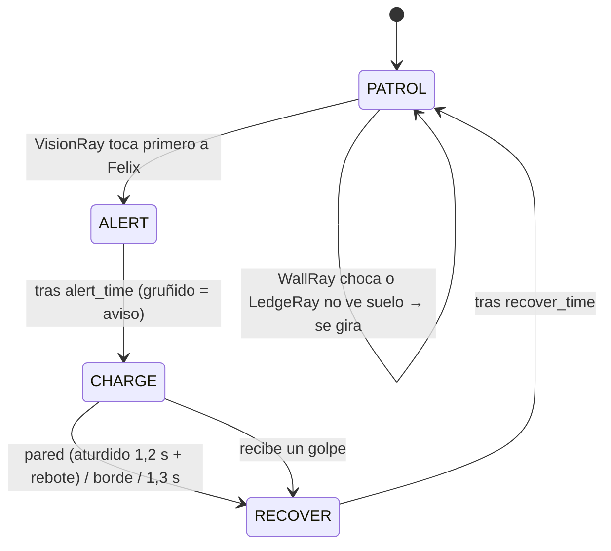

# 03 · Enemigos, obstáculos y niveles

## 1. Clase base `Enemy`

`scripts/enemies/Enemy.gd` resuelve lo común y deja la IA a cada subclase:

| Resuelve `Enemy` | Implementa cada enemigo |
|---|---|
| Gravedad (opcional), `move_and_slide()` | `_physics_ai(delta)`: la IA |
| Golpe recibido: retroceso × (1 − `knockback_resistance`), aturdimiento de 0,3 s, destello blanco (`self_modulate` > 1) | `_on_hit_reaction(hit)`: p. ej. cancelar la embestida |
| **Aturdido = sin daño por contacto** (el `ContactHitbox` se apaga) | `_on_stun_ended()`: volver a patrullar |
| Orientación (`set_facing`) y `flip_h` | `_on_facing_changed()`: girar RayCasts |
| Muerte: desactiva colisiones, suelta monedas con imán, nube de polvo, `EventBus.enemy_defeated`, se desvanece | — |

Estructura común de las escenas: `Visuals/Sprite` (con normal map), `AnimationPlayer`, `HealthComponent` (salvo invencibles), `Hurtbox` (capa 7) y `ContactHitbox` (capa 5 → máscara 6, `rehit_interval` 0,5 s).

## 2. Perro callejero (`StrayDog`) — terrestre con embestida y RayCast2D

Los tres `RayCast2D`:

| RayCast | Posición → destino | Máscara | Para qué |
|---|---|---|---|
| `VisionRay` | (0,−11) → (±150, 0) | world + player | **Línea de visión**: detecta mundo y jugador; si lo primero que toca es Felix, lo ve. Una pared en medio lo tapa. Si Felix salta por encima, no lo ve. |
| `WallRay` | (0,−8) → (±16, 0) | world | Pared delante (girar en patrulla, estrellarse en la embestida) |
| `LedgeRay` | (±14,−2) → (0, 12) | world | Suelo delante: no caerse de los bordes |

Al girar, `_on_facing_changed()` invierte los destinos y llama a `force_raycast_update()`.

| Parámetro | Por defecto | Efecto en dificultad |
|---|---|---|
| `patrol_speed` | 40 px/s | Ritmo de patrulla |
| `alert_time` | 0,45 s | **Telegrafía**: menos tiempo = menos margen para reaccionar |
| `charge_speed` | 230 px/s | Más rápido que Felix (150): no se puede huir, hay que saltar o golpear |
| `charge_damage` / `charge_knockback` | 2 / 260 | Castigo por no esquivar |
| `wall_stun_time` / `recover_time` | 1,2 / 0,7 s | Ventana para castigarlo (mareado no hace daño por contacto) |
| Vida | 6 | 5 rasguños + aullido, o una ráfaga con Furia |

## 3. Cuervo (`Crow`) — aéreo con movimiento senoidal

- Patrulla horizontalmente entre `origen ± patrol_distance` (120 px) a `fly_speed` (55 px/s).
- Altura: `y(t) = y₀ + A · sin(2π · f · t)` con A = 18 px y f = 0,8 Hz. La velocidad vertical es un **resorte** hacia esa curva (`(y_objetivo − y) × 8`), así tras un empujón vuelve suavemente a su trayectoria.
- Fase aleatoria al aparecer: varios cuervos no aletean sincronizados.
- **Picado** (`can_swoop`, niveles 6, 9 y 10): si Felix está debajo y a menos de 120 px, se lanza a su posición a 190 px/s y luego regresa a su ruta; enfriamiento de 2,5 s.
- `MOTION_MODE_FLOATING`, sin gravedad, vida 2. Grupo `air_enemy`: **inmune al Golpe Sísmico**, vulnerable al Aullido (su alcance vertical es perfecto para derribarlos).

## 4. Aspiradora robot (`RobotVacuum`) — invencible, rebota en paredes

- Avanza a `move_speed` y, cuando `is_on_wall()`, usa `get_wall_normal()`: solo se gira si la pared está **delante** (evita girar dos veces en el mismo contacto).
- Opcionalmente se gira en los bordes (`LedgeRay`).
- `Hurtbox.invincible = true`: los ataques emiten `blocked` → chispas (`SparkBurst`) y destello, sin daño ni retroceso.
- Única respuesta: saltar por encima. En los niveles se colocan en "salas" con muros de 2 tiles para que el rebote sea predecible.
- Lleva una pequeña luz LED cian (`PointLight2D`) que ilumina el suelo.

## 5. Obstáculos

| Obstáculo | Escena | Comportamiento |
|---|---|---|
| **Charco** | `Puddle.tscn` (Area2D, `@tool`) | Al entrar registra `add_speed_modifier(self, 0.5)` en el cuerpo; al salir lo quita. Varios charcos no se pisan entre sí. Salpicadura al entrar. Superficie con mapa especular: refleja las farolas. `width` ajustable en el editor. |
| **Caja colgante** | `FallingCrate.tscn` | WAITING (cuelga de una cuerda) → el `Detector` (columna de 180 px) ve a Felix → SHAKING 0,45 s (aviso) → FALLING (hitbox activo, 2 de daño) → LANDED: pasa a la capa `world` y **sirve de plataforma**. |
| **Grúa de cajas** | `CrateSpawner.tscn` | `ObstacleSpawner` que suelta cajas con `drop_immediately` y `break_on_land` cada 2,2 s (máx. 3 vivas). |
| **Ovillo gigante** | `YarnBall.tscn` | Rueda con gravedad (cae por escalones). La animación avanza **por distancia recorrida** (8 frames dibujados, sin rotar píxeles). Se deshace al chocar con una pared (o rebota si `bounce_on_walls`). Invencible, 1 de daño. |
| **Cesto de ovillos** | `YarnBallSpawner.tscn` | `ObstacleSpawner` con `{"direction": -1.0}`: los ovillos ruedan hacia Felix. |

`ObstacleSpawner` solo trabaja mientras su `VisibleOnScreenNotifier2D` está en pantalla (en móvil no se simula lo que no se ve) y configura cada instancia con el diccionario `instance_properties`, sin código.

## 6. Monedas

`Coin.tscn` gira cambiando el frame por tiempo (sin `AnimationPlayer`: decenas de monedas cuestan casi nada) y flota con un seno redondeado a píxeles enteros. Las que sueltan los enemigos saltan y tras 0,45 s vuelan hacia Felix (imán): en pantalla táctil perseguir monedas es incómodo. Al recogerlas: `Global.add_run_coins()` + `EventBus.coin_collected`.

## 7. Progresión de los 10 niveles

Regla: **cada nivel introduce un elemento nuevo** en un contexto seguro y después lo combina con lo ya conocido. La dificultad sube por parámetros (telegrafía más corta, más velocidad) además de por cantidad.

| # | Nombre | Tema del tileset | Novedad | Enemigos y obstáculos | Ajustes de dificultad |
|---|---|---|---|---|---|
| 1 | Callejón al Anochecer | Calle | Tutorial (8 carteles) | Perros lentos, charcos, fosos | Perro: alerta 0,7 s, embestida 190 |
| 2 | Tejados de Hojalata | Tejado | **Cuervos**, saltos con fosos | Cuervos, perros, plataformas | Alerta 0,6 s |
| 3 | Mercado Nocturno | Calle | **Cajas colgantes** | Cajas, perros, cuervos, charcos | Alerta 0,55 s, cajas tiemblan 0,5 s |
| 4 | Lavandería 24 Horas | Ladrillo | **Aspiradoras** | Salas con aspiradoras, charcos grandes, perros | Alerta 0,5 s, aspiradora 65 |
| 5 | Almacén de Juguetes | Metal | **Ovillos** y **grúas** | Ovillos, grúas de cajas, aspiradora | Ovillo cada 3,6 s, grúa 2,6 s |
| 6 | Parque bajo la Lluvia | Calle (oscuro) | **Cuervos en picado** | Muchos charcos, manadas de perros | Alerta 0,45 s, embestida 220 |
| 7 | Callejones de Neón | Ladrillo | Combinación rápida | Perros veloces, aspiradoras, grúas | Alerta 0,35 s, embestida 250, aspiradora 85 |
| 8 | Fábrica de Estambre | Metal | Barreras de ovillos | Ovillos rápidos, aspiradoras, cajas | Ovillo cada 2,8 s a 125 px/s |
| 9 | Tormenta en los Tejados | Tejado (noche) | Fosos dobles | Todos, cuervos en picado constantes | Picado cada 2,2 s a 210 |
| 10 | El Gran Refugio | Calle (noche) | Prueba final | Todo combinado | Alerta 0,3 s, embestida 260, aspiradora 90 |

## 8. Cómo se construyen los niveles

Los niveles actuales son **greybox jugables**: la estructura de nodos es la definitiva y se pueden seguir editando en el editor (pintar tiles, mover enemigos, añadir luces).

1. `tools/levels/generate_level_maps.py` arma cada nivel encadenando **tramos** probados con la física de Felix (`flat`, `gap`, `stairs`, `platforms`, `dog_zone`, `crow_zone`, `vacuum_room`, `crate_zone`, `crane_zone`, `yarn_run`…). Cada nivel empieza con una **zona segura** de 18 tiles donde ningún enemigo ve a Felix.
2. El resultado son mapas ASCII legibles en `tools/levels/level_XX.txt` (cabecera + mapa + capa de fondo).
3. `tools/LevelBuilder.gd` (Godot en modo headless) convierte cada mapa en `scenes/levels/Level_N.tscn`.

Leyenda del mapa:

| Carácter | Significado | Carácter | Significado |
|---|---|---|---|
| `#` | Suelo (superficie o relleno automático según el tema) | `P` | Inicio de Felix |
| `B` / `M` | Bloque de ladrillo / metal | `S` | Refugio de Gatos (meta) |
| `=` | Plataforma de un sentido (izq./centro/der. automáticos) | `c` | Moneda |
| `g` | Hierba (primer plano) | `D` / `C` / `W` / `V` | Perro / cuervo / cuervo con picado / aspiradora |
| `~` | Charco (ancho = caracteres seguidos) | `X` / `K` / `Y` | Caja colgante / grúa / cesto de ovillos |
| `L` / `T` | Farola / cartel de tutorial | fondo: `w` `o` `n` | Pared / ventana encendida / ventana apagada |

En la cabecera, líneas como `dog.alert_time=0.35` o `yarn.interval=2.8` sobrescriben propiedades de todas las instancias de ese tipo en el nivel (`dog`, `crow`, `vacuum`, `hanging_crate`, `crates`, `yarn`).

> ⚠️ Regenerar un `.tscn` sobrescribe los cambios hechos a mano en el editor. Flujo recomendado: usar el generador para el greybox inicial y, a partir de ahí, editar el nivel en Godot.
