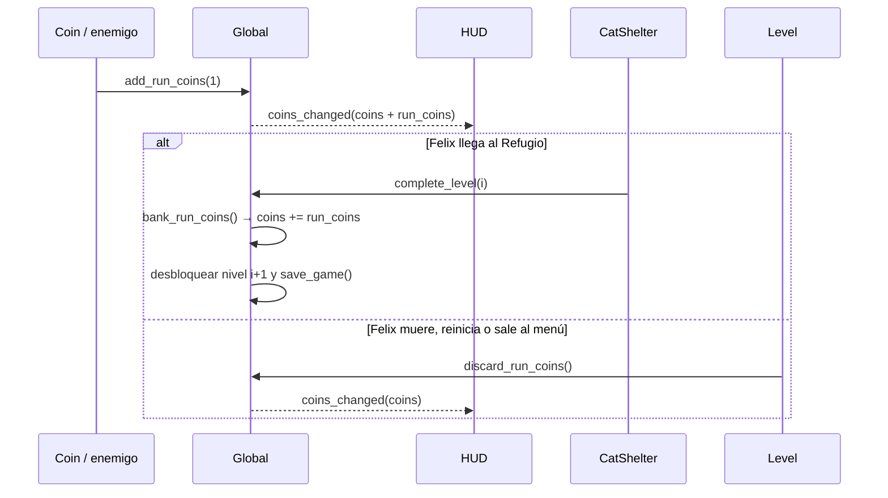

# 07 · Economía, guardado y tienda de skins (`Global.gd`)

`scripts/autoload/Global.gd` es el Autoload **Global**: el único lugar donde viven los datos persistentes del jugador y el único que escribe el archivo de guardado. Al ser un Autoload no se destruye al cambiar de escena, por eso las monedas persisten entre niveles; el guardado en disco las mantiene entre sesiones.

## 1. Modelo de datos

| Variable | Tipo | Significado |
|---|---|---|
| `coins` | `int` | **Monedero depositado**: lo único que se puede gastar. Su *setter* emite `coins_changed`. |
| `run_coins` | `int` | Monedas del **intento actual** (aún sin depositar). |
| `owned_skins` | `Array[StringName]` | Skins compradas (las gratuitas siempre incluidas). |
| `equipped_skin_id` | `StringName` | Skin activa. |
| `unlocked_level_count` | `int` | Niveles disponibles (1 = solo el primero). |
| `game_completed` | `bool` | Se completó el nivel 10. |
| `current_level_index` | `int` | Nivel en juego (base 0); −1 en menús. Lo fija `Level.gd`. |
| `vibration_enabled` | `bool` | Ajuste de vibración (menú de pausa). |

## 2. Flujo de monedas: depositar solo al llegar al Refugio



¿Por qué no sumar directamente al monedero? Porque las monedas reaparecen al reiniciar el nivel: si contaran al instante, bastaría con recoger unas cuantas y morir a propósito para farmear sin fin. Así, solo cuenta lo que Felix lleva a salvo al Refugio (y rejugar niveles completos sí está permitido y recompensado).

El HUD muestra el total (`coins + run_coins`); la tienda muestra solo `coins` (lo gastable).

## 3. API pública

| Método | Uso |
|---|---|
| `get_total_coins()` | Total visible en el HUD |
| `add_run_coins(n)` / `bank_run_coins()` / `discard_run_coins()` | Ciclo de monedas de un nivel |
| `add_coins(n)` / `spend_coins(n)` / `can_afford(precio)` | Monedero (recompensas, compras) |
| `get_skins()` / `get_skin(id)` / `is_skin_owned(id)` | Consultas de la tienda |
| `purchase_skin(id)` → `PurchaseResult` | `SUCCESS`, `ALREADY_OWNED`, `NOT_ENOUGH_COINS`, `UNKNOWN_SKIN` |
| `equip_skin(id)` / `get_equipped_skin()` | Skin activa |
| `complete_level(i)` / `is_level_unlocked(i)` / `get_resume_level_index()` | Progresión |
| `vibrate(ms, amplitud)` / `set_vibration_enabled(b)` | Háptica en móvil |
| `save_game()` / `load_game()` / `reset_progress()` | Persistencia |

Señales: `coins_changed(total)`, `skin_purchased(id)`, `skin_equipped(id)`, `level_unlocked(i)`.

## 4. Guardado

- Archivo: `user://savegame.cfg` (`ConfigFile`, legible). En Android va al almacenamiento interno privado de la app.
- **Guardado atómico**: se escribe `savegame.tmp.cfg` y después se renombra encima del real. Si el sistema mata la app a mitad de escritura, la partida anterior sigue intacta.
- **Cuándo se guarda**: al comprar, equipar, completar un nivel, cambiar la vibración, y en `NOTIFICATION_APPLICATION_PAUSED` (la app pasa a segundo plano: Android/iOS pueden cerrarla sin avisar) y `NOTIFICATION_WM_CLOSE_REQUEST`.
- **Carga defensiva**: se ignoran ids de skins desconocidos, se asegura la skin por defecto, se limitan valores fuera de rango y se tolera un archivo manipulado o de otra versión (`meta/version` permite migraciones futuras).

Ejemplo del archivo:

```ini
[meta]
version=1

[wallet]
coins=550

[shop]
owned_skins=PackedStringArray("classic", "midnight")
equipped_skin="midnight"

[progress]
unlocked_levels=3
game_completed=false

[settings]
vibration=true
```

> Anti‑trampas: en un juego offline no hay forma infalible. Si te preocupa, cambia `config.save()` por `config.save_encrypted_pass(ruta, clave)` (y `load_encrypted_pass`). Si algún día hay compras reales o rankings, la validación debe hacerse en un servidor.

## 5. Tienda de skins

### Datos: `SkinData` + `SkinCatalog`

Cada skin es un recurso `resources/skins/skin_<id>.tres` (`scripts/resources/SkinData.gd`):

| Campo | Ejemplo |
|---|---|
| `id` | `&"midnight"` (estable: se guarda en la partida) |
| `display_name` / `description` | "Sombra de Medianoche" / texto de la tarjeta |
| `price` | 150 (0 = gratuita y poseída desde el inicio) |
| `sprite_sheet` | `felix_midnight.png` (mismo layout que la base) |
| `normal_map` | Vacío = reutiliza el de la base (misma silueta) |
| `preview_cell` | Celda de la miniatura (idle, frame 0) |
| `accent_color` | Tinte de la tarjeta |

`resources/skins/SkinCatalog.tres` contiene la lista ordenada. Skins incluidas:

| Skin | Precio | Idea |
|---|---|---|
| Felix Clásico | 0 | Atigrado naranja |
| Sombra de Medianoche | 150 | Gato negro de ojos dorados |
| Siamés Real | 300 | Crema con puntas chocolate |
| Copo de Nieve | 450 | Blanco esponjoso |
| Cyber Felix | 800 | Rayas de neón |

### Balance

Una partida completa recogiendo todo da unas **440 monedas** (monedas del mapa + 3 por perro + 1 por cuervo):

| Nivel | 1 | 2 | 3 | 4 | 5 | 6 | 7 | 8 | 9 | 10 |
|---|---|---|---|---|---|---|---|---|---|---|
| Monedas | 46 | 52 | 31 | 34 | 32 | 47 | 50 | 35 | 54 | 59 |
| Acumulado | 46 | 98 | 129 | 163 | 195 | 242 | 292 | 327 | 381 | 440 |

La primera skin llega hacia el nivel 4; las cuatro de pago suman 1700, una meta a largo plazo que invita a rejugar niveles para mejorar.

### Interfaz (`Shop.tscn`)

- Las tarjetas (`SkinCard.tscn`) se generan desde el catálogo: añadir una skin al catálogo basta para que aparezca.
- Cada tarjeta anima el *idle* de Felix con esa skin (`AtlasTexture` cuya región avanza por los frames de la fila 0).
- Botón: **Comprar N** (rojizo si no alcanza) → **Equipar** → **Equipada**. Si faltan monedas: sacudida de la tarjeta, vibración corta y mensaje "Te faltan N monedas".
- El botón "atrás" de Android vuelve al menú.

## 6. Cómo se aplica la skin al instanciar el nivel

```gdscript
# Player.gd
func _ready() -> void:
	...
	var base_texture := sprite.texture as CanvasTexture   # textura de la escena = skin base
	_base_normal_map = base_texture.normal_texture         # se conserva el normal map
	apply_skin(Global.get_equipped_skin())                 # ← la skin elegida en la tienda
	Global.skin_equipped.connect(_on_skin_equipped)        # cambios en caliente
```

`apply_skin()` crea un `CanvasTexture` nuevo con la hoja de la skin como *diffuse* y el normal map base (o el propio de la skin). Como todas las hojas comparten layout, el `AnimationPlayer`, los hitboxes y la máquina de estados no cambian. El menú principal también muestra a Felix con la skin equipada.

## 7. Añadir una skin nueva

1. Recolorea `felix_classic.png` (misma silueta) → `assets/sprites/player/felix_<id>.png`.
2. En el FileSystem: clic derecho → *New Resource* → `SkinData` → guarda como `resources/skins/skin_<id>.tres` y rellena los campos.
3. Abre `SkinCatalog.tres` y añade la skin a la lista `skins`.
4. Listo: aparece en la tienda y se puede comprar y equipar.
